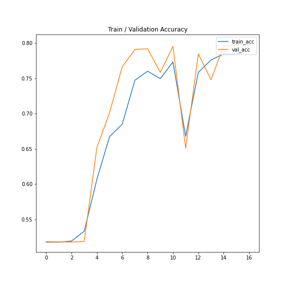

# Financial U-Net FFwD

## Modelling

For this project, we will use the following models:
- DistilBERT to extract the features from the set of buy/sell sides of the order book

For the final layer, we will use the following models:
- A simple feedforward neural network to predict the price movement based on the previous prices + features from the previous step
- Convolutional Neural Network to predict the price movement based on the previous prices + features from the previous step
- Recurrent Neural Network to predict the price movement based on the previous prices + features from the previous step

### Prediction target:
- We will predict the next action (buy/sell)
- The price of this action
- The amount traded


## Architecture of the Neural Network


### Configuration

```python
epochs = 1
batch_size = 512
max_seq_len = 512
learning_rate = 1e-5
max_grad_norm = 1000
hidden_dim = 3
```

### Results Table:

| Model                | Val loss       | Val acc | Val f1 | Val precision | Val recall | Val Price RMSE | Val Price MAPE     | Val Amount RMSE | Val Amount MAPE    |
|----------------------|----------------|---------|--------|---------------|------------|----------------|--------------------|-----------------|--------------------|
| FFwD                 | 87461085.5548  | 0.8120  | 0.8115 | 0.8119        | 0.8113     | 16853.8339     | 2619650877685760.0 | 8509.8906       | 5010660245110784.0 |
| Financial U-Net FFwD | 102821550.3097 | 0.7988  | 0.7988 | 0.7991        | 0.7995     | 16416.7109375  | 329857212874752.0  | 8655.359375     | 409164085985280.0  |

### Ablation Study





